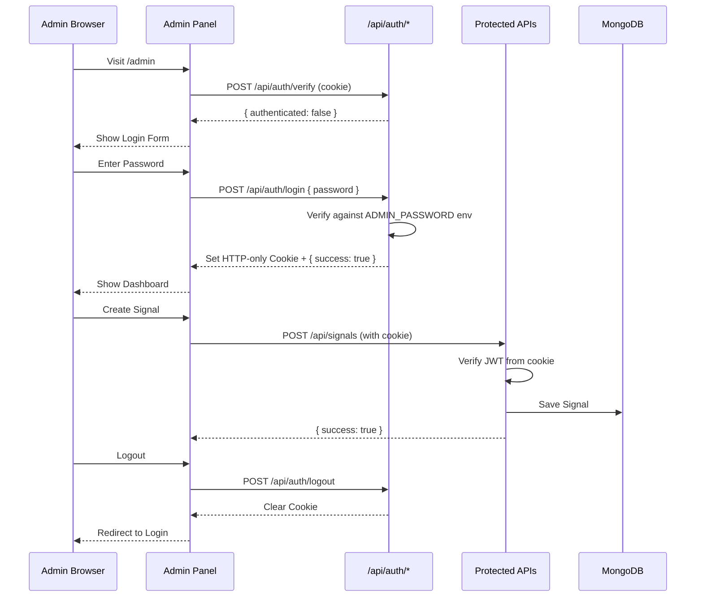

# Design Document: Admin Authentication Security

## Overview

هذا التصميم يهدف إلى تأمين لوحة تحكم الأدمن في منصة Abu Al-Dahab VIP Signals عن طريق:
1. نقل التحقق من كلمة المرور من الـ Frontend إلى الـ Backend
2. استخدام متغيرات البيئة لتخزين البيانات الحساسة
3. تطبيق نظام JWT للحفاظ على جلسة تسجيل الدخول

## Architecture



## Components and Interfaces

### 1. Auth API Routes

```
app/api/auth/
├── login/route.js      # POST - تسجيل الدخول
├── verify/route.js     # POST - التحقق من الجلسة
└── logout/route.js     # POST - تسجيل الخروج
```

### 2. Auth Middleware

```javascript
// lib/auth.js
export async function verifyAuth(request) {
  // Extract JWT from cookie
  // Verify signature and expiration
  // Return { authenticated: boolean, error?: string }
}

export function generateToken(payload) {
  // Generate JWT with claims
  // Return signed token
}

export function setAuthCookie(response, token) {
  // Set HTTP-only secure cookie
}

export function clearAuthCookie(response) {
  // Clear authentication cookie
}
```

### 3. Login API Interface

```javascript
// POST /api/auth/login
// Request:
{
  "password": "string"
}

// Response (Success):
{
  "success": true,
  "message": "Login successful"
}
// + Set-Cookie: admin_token=<JWT>; HttpOnly; Secure; SameSite=Strict; Path=/; Max-Age=86400

// Response (Failure):
{
  "success": false,
  "error": "Invalid password"
}
// Status: 401
```

### 4. Verify API Interface

```javascript
// POST /api/auth/verify
// Request: (cookie sent automatically)

// Response (Authenticated):
{
  "authenticated": true,
  "expiresAt": "2024-12-24T12:00:00Z"
}

// Response (Not Authenticated):
{
  "authenticated": false,
  "error": "Token expired" | "Invalid token" | "No token provided"
}
```

### 5. Logout API Interface

```javascript
// POST /api/auth/logout
// Response:
{
  "success": true,
  "message": "Logged out successfully"
}
// + Set-Cookie: admin_token=; HttpOnly; Secure; SameSite=Strict; Path=/; Max-Age=0
```

## Data Models

### JWT Token Structure

```javascript
{
  "role": "admin",           // User role
  "iat": 1703318400,         // Issued at (Unix timestamp)
  "exp": 1703404800          // Expiration (24 hours from iat)
}
```

### Environment Variables

```env
# Required
ADMIN_PASSWORD=your_secure_password_here
JWT_SECRET=your_jwt_secret_key_here

# Existing
MONGODB_URI=...
TELEGRAM_BOT_TOKEN=...
```

## Correctness Properties

*A property is a characteristic or behavior that should hold true across all valid executions of a system—essentially, a formal statement about what the system should do. Properties serve as the bridge between human-readable specifications and machine-verifiable correctness guarantees.*

### Property 1: Password Verification Correctness

*For any* password input, if it matches the ADMIN_PASSWORD environment variable, the login API SHALL return success with a valid JWT token; otherwise it SHALL return 401 status.

**Validates: Requirements 1.2, 1.4, 1.5**

### Property 2: Token Generation Contains Required Claims

*For any* successful authentication, the generated JWT token SHALL contain: role="admin", valid iat (issued at), and exp (expiration) set to 24 hours from iat.

**Validates: Requirements 3.1, 3.3**

### Property 3: Token Round-Trip Consistency

*For any* valid JWT token, encoding the claims then decoding the token SHALL produce equivalent claims (role, iat, exp).

**Validates: Requirements 6.3**

### Property 4: Token Validation Rejects Invalid Tokens

*For any* token that has an invalid signature, is expired, or has malformed structure, the verification function SHALL reject it and return an appropriate error.

**Validates: Requirements 6.2, 6.4, 6.5**

### Property 5: Protected Routes Require Authentication

*For any* request to a protected route (POST/PUT/DELETE on /api/signals, POST on /api/users, POST on /api/settings) without a valid JWT token, the system SHALL return 401 status.

**Validates: Requirements 5.2, 5.5**

### Property 6: Password Never Exposed in Responses

*For any* API response from the authentication system, the response body SHALL NOT contain the ADMIN_PASSWORD value.

**Validates: Requirements 1.3**

## Error Handling

### Authentication Errors

| Error Code | Condition | Response |
|------------|-----------|----------|
| 401 | Invalid password | `{ success: false, error: "Invalid password" }` |
| 401 | No token provided | `{ authenticated: false, error: "No token provided" }` |
| 401 | Token expired | `{ authenticated: false, error: "Token expired" }` |
| 401 | Invalid token signature | `{ authenticated: false, error: "Invalid token" }` |
| 500 | ADMIN_PASSWORD not configured | `{ success: false, error: "Server configuration error" }` |

### Security Considerations

1. **HTTP-only Cookies**: Prevents XSS attacks from accessing the token
2. **Secure Flag**: Cookie only sent over HTTPS in production
3. **SameSite=Strict**: Prevents CSRF attacks
4. **24-hour Expiration**: Limits exposure window if token is compromised
5. **No Password in Client**: Password never leaves the server

## Testing Strategy

### Unit Tests

1. **Token Generation**: Test that tokens contain required claims
2. **Token Verification**: Test valid/invalid/expired tokens
3. **Password Verification**: Test correct/incorrect passwords
4. **Cookie Handling**: Test cookie setting and clearing

### Property-Based Tests

Using a property-based testing library (e.g., fast-check), we will test:

1. **Password Verification Property**: Generate random passwords, verify correct behavior
2. **Token Round-Trip Property**: Generate random claims, verify encode/decode consistency
3. **Token Validation Property**: Generate invalid tokens, verify rejection
4. **Protected Routes Property**: Test all protected routes without auth

### Integration Tests

1. **Full Login Flow**: Login → Access Protected Route → Logout
2. **Token Expiration**: Verify behavior when token expires
3. **Concurrent Sessions**: Verify multiple admin sessions work correctly

### Test Configuration

- Property tests: Minimum 100 iterations per property
- Test framework: Vitest (already configured in project)
- Property testing library: fast-check
