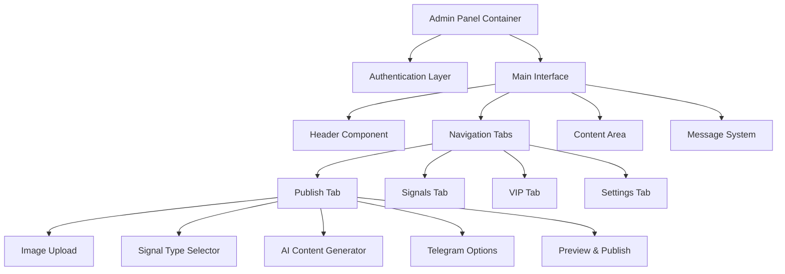

# تصميم استعادة لوحة الإدارة المحسنة

## نظرة عامة

هذا التصميم يهدف إلى استعادة وتحسين لوحة الإدارة لتطبيق إشارات التداول، مع التركيز على استعادة الوظائف المفقودة وتحسين تجربة المستخدم. التصميم يجمع بين الوظائف المتقدمة والواجهة الحديثة لتوفير أداة إدارة شاملة وفعالة.

## الهيكل المعماري

### البنية العامة



### مكونات النظام والواجهات

#### 1. مكون المصادقة (Authentication Component)

```typescript
interface AuthenticationState {
  isAuthenticated: boolean;
  password: string;
  loginError: string;
  sessionTimeout: number;
}

interface AuthenticationMethods {
  handleLogin(password: string): Promise<boolean>;
  handleLogout(): void;
  validateSession(): boolean;
  refreshSession(): void;
}
```

**الوظائف الأساسية:**
- التحقق من كلمة المرور (admin123)
- إدارة جلسة المستخدم
- حفظ حالة المصادقة في sessionStorage
- واجهة تسجيل دخول أنيقة مع تأثيرات بصرية

#### 2. مكون إدارة التبويبات (Tab Management Component)

```typescript
interface TabState {
  activeTab: 'publish' | 'signals' | 'vip' | 'settings';
  tabCounts: {
    signals: number;
    vip: number;
  };
}

interface TabMethods {
  switchTab(tabId: string): void;
  updateTabCount(tabId: string, count: number): void;
  preserveTabState(): void;
}
```

**التصميم البصري:**
- أربعة تبويبات رئيسية مع أيقونات مميزة
- عدادات ديناميكية للإشارات والمستخدمين VIP
- تأثيرات انتقال سلسة بين التبويبات
- حفظ حالة كل تبويب عند التنقل

#### 3. مكون معالجة الصور (Image Processing Component)

```typescript
interface ImageProcessor {
  selectedFile: File | null;
  previewData: string | null;
  isProcessing: boolean;
}

interface ImageMethods {
  handleFileUpload(file: File): Promise<void>;
  handlePasteImage(event: ClipboardEvent): Promise<void>;
  createBlurredVersion(file: File): Promise<string>;
  compressImage(file: File, quality: number): Promise<File>;
  validateImageFormat(file: File): boolean;
}
```

**الميزات المتقدمة:**
- دعم السحب والإفلات (Drag & Drop)
- لصق الصور من الحافظة (Ctrl+V)
- إنشاء نسخ مطمسة تلقائياً للإشارات VIP
- ضغط الصور للحصول على أفضل أداء
- معاينة فورية مع إمكانية التغيير

#### 4. مكون توليد المحتوى بالذكاء الاصطناعي (AI Content Generator)

```typescript
interface AIGenerator {
  geminiApiKey: string;
  selectedModel: 'gemini-2.0-flash' | 'gemini-1.5-pro' | 'gemini-1.5-flash';
  postCount: number;
  aiPrompt: string;
  generatedPosts: string[];
  selectedPostIndex: number;
  isGenerating: boolean;
}

interface AIMethods {
  generatePosts(originalText: string): Promise<string[]>;
  selectPost(index: number): void;
  saveAISettings(): Promise<void>;
  loadAISettings(): Promise<void>;
}
```

**خوارزمية التوليد:**
1. إرسال النص الأصلي مع القالب المخصص إلى Gemini API
2. معالجة الاستجابة وتنظيف النصوص
3. عرض النتائج في شبكة قابلة للتمرير
4. السماح بالاختيار والمعاينة الفورية

#### 5. مكون إدارة أنواع الإشارات (Signal Type Manager)

```typescript
interface SignalType {
  type: 'vip' | 'free' | 'regular';
  description: string;
  icon: string;
  telegramBehavior: 'blur' | 'clear' | 'normal';
}

interface SignalTypeManager {
  currentType: SignalType;
  availableTypes: SignalType[];
  setSignalType(type: string): void;
  getTypeConfiguration(type: string): SignalType;
}
```

**أنواع الإشارات:**
- **VIP (💎)**: صور مطمسة في التليجرام، واضحة في التطبيق
- **Free (🎁)**: صور واضحة في جميع المنصات
- **Regular (📝)**: منشورات عادية بدون تصنيف خاص

#### 6. مكون إدارة التليجرام (Telegram Integration)

```typescript
interface TelegramOptions {
  postToTelegram: boolean;
  buttonType: 'view_signal' | 'share' | 'subscribe' | 'none';
  customMessage?: string;
}

interface TelegramMethods {
  sendSignalToTelegram(signal: Signal, options: TelegramOptions): Promise<boolean>;
  createInlineKeyboard(buttonType: string): InlineKeyboard;
  processImageForTelegram(image: File, isVIP: boolean): Promise<string>;
}
```

**أنواع الأزرار التفاعلية:**
- **💎 عرض الإشارة**: يوجه للتطبيق لعرض الإشارة كاملة
- **📤 مشاركة**: يسمح بمشاركة الإشارة
- **🔥 اشتراك**: يوجه لصفحة الاشتراك
- **🚫 بدون زر**: بدون أزرار تفاعلية

## نماذج البيانات

### نموذج الإشارة المحسن

```typescript
interface Signal {
  _id: string;
  pair: string;
  type: 'SIGNAL' | 'REGULAR';
  imageUrl: string;
  telegramImage?: string;
  customPost?: string;
  isVip: boolean;
  sendToTelegram: boolean;
  telegramButtonType: string;
  createdAt: Date;
  updatedAt: Date;
  metadata: {
    originalFileName?: string;
    imageSize?: number;
    processingTime?: number;
  };
}
```

### نموذج المستخدم VIP

```typescript
interface VIPUser {
  _id: string;
  telegramId: string;
  firstName?: string;
  lastName?: string;
  isVip: boolean;
  isLifetime: boolean;
  subscriptionStartDate: Date;
  subscriptionEndDate?: Date;
  durationMonths?: number;
  createdAt: Date;
  lastActivity?: Date;
}
```

### نموذج الإعدادات

```typescript
interface AdminSettings {
  _id: string;
  geminiApiKey: string;
  selectedModel: string;
  aiPrompt: string;
  generatedPostCount: number;
  defaultSignalType: string;
  telegramSettings: {
    defaultPostToTelegram: boolean;
    defaultButtonType: string;
  };
  uiSettings: {
    theme: 'dark' | 'light';
    language: 'ar' | 'en';
    autoSave: boolean;
  };
}
```

## خصائص الصحة والاختبار

*خاصية هي سمة أو سلوك يجب أن يكون صحيحاً عبر جميع التنفيذات الصالحة للنظام - في الأساس، بيان رسمي حول ما يجب أن يفعله النظام. الخصائص تعمل كجسر بين المواصفات المقروءة للبشر وضمانات الصحة القابلة للتحقق آلياً.*

### الخصائص الأساسية

#### خاصية 1: حفظ حالة التبويبات
*لأي* تبويب نشط وأي بيانات مدخلة، التنقل إلى تبويب آخر ثم العودة يجب أن يحافظ على جميع البيانات المدخلة
**يتحقق من: المتطلبات 1.3**

#### خاصية 2: معالجة الصور الآمنة
*لأي* ملف صورة صالح، رفعه أو لصقه يجب أن ينتج معاينة صحيحة بدون أخطاء
**يتحقق من: المتطلبات 2.1, 2.2**

#### خاصية 3: التطميس التلقائي للإشارات VIP
*لأي* إشارة من نوع VIP مع صورة، يجب إنشاء نسخة مطمسة تلقائياً للتليجرام
**يتحقق من: المتطلبات 2.3, 6.2**

#### خاصية 4: توليد المحتوى بالذكاء الاصطناعي
*لأي* نص إدخال صالح مع إعدادات AI صحيحة، يجب توليد العدد المطلوب من النسخ المتنوعة
**يتحقق من: المتطلبات 3.1, 3.2**

#### خاصية 5: اختيار النسخ المولدة
*لأي* نسخة مولدة بالذكاء الاصطناعي، النقر عليها يجب أن يحددها ويستخدمها في النشر النهائي
**يتحقق من: المتطلبات 3.3, 3.4**

#### خاصية 6: تحرير الإشارات
*لأي* إشارة موجودة، النقر على تحرير يجب أن يحمل جميع بياناتها في نموذج التحرير بدقة
**يتحقق من: المتطلبات 5.1, 5.2**

#### خاصية 7: إدارة المستخدمين VIP
*لأي* معرف تليجرام صالح ومدة اشتراك، إضافة المستخدم يجب أن تحسب تاريخ الانتهاء بدقة
**يتحقق من: المتطلبات 7.2, 7.3**

#### خاصية 8: حفظ الإعدادات
*لأي* تغيير في إعدادات النظام، الحفظ يجب أن يحدث بنجاح ويظهر رسالة تأكيد
**يتحقق من: المتطلبات 8.6, 8.7**

#### خاصية 9: الاستجابة السريعة
*لأي* عملية في النظام، يجب أن تكتمل في أقل من 5 ثوانٍ أو تظهر مؤشر تحميل
**يتحقق من: المتطلبات 9.1, 9.2**

#### خاصية 10: معالجة الأخطاء
*لأي* خطأ يحدث في النظام، يجب عرض رسالة خطأ واضحة ومفيدة للمستخدم
**يتحقق من: المتطلبات 9.4**

## معالجة الأخطاء

### استراتيجية معالجة الأخطاء الشاملة

1. **أخطاء الشبكة**: إعادة المحاولة التلقائية مع رسائل واضحة
2. **أخطاء رفع الصور**: التحقق من الصيغة والحجم مع اقتراحات للحلول
3. **أخطاء API الذكاء الاصطناعي**: التحقق من صحة المفتاح وتوفر الخدمة
4. **أخطاء قاعدة البيانات**: حفظ البيانات محلياً مؤقتاً وإعادة المحاولة
5. **أخطاء التليجرام**: تسجيل مفصل مع إمكانية إعادة الإرسال

### رسائل الأخطاء المحلية

```typescript
const errorMessages = {
  ar: {
    networkError: 'خطأ في الاتصال. يرجى المحاولة مرة أخرى.',
    imageUploadError: 'فشل في رفع الصورة. تأكد من صيغة الملف.',
    aiGenerationError: 'فشل في توليد المحتوى. تحقق من إعدادات الذكاء الاصطناعي.',
    saveError: 'فشل في الحفظ. تم حفظ البيانات محلياً.',
    telegramError: 'فشل في الإرسال للتليجرام. تم حفظ الإشارة محلياً.'
  },
  en: {
    networkError: 'Connection error. Please try again.',
    imageUploadError: 'Image upload failed. Check file format.',
    aiGenerationError: 'Content generation failed. Check AI settings.',
    saveError: 'Save failed. Data saved locally.',
    telegramError: 'Telegram send failed. Signal saved locally.'
  }
};
```

## استراتيجية الاختبار

### اختبار الوحدة (Unit Testing)

**اختبارات محددة للأمثلة والحالات الحدية:**
- اختبار تسجيل الدخول بكلمات مرور صحيحة وخاطئة
- اختبار رفع صور بصيغ مختلفة وأحجام متنوعة
- اختبار توليد المحتوى مع نصوص فارغة وطويلة
- اختبار حفظ الإعدادات مع قيم صالحة وغير صالحة

### اختبار الخصائص (Property-Based Testing)

**اختبارات شاملة للخصائص العامة:**
- اختبار حفظ حالة التبويبات مع بيانات عشوائية
- اختبار معالجة الصور مع ملفات متنوعة
- اختبار توليد المحتوى مع نصوص وإعدادات مختلفة
- اختبار إدارة المستخدمين VIP مع تواريخ متنوعة

**إعدادات اختبار الخصائص:**
- الحد الأدنى 100 تكرار لكل اختبار خاصية
- كل اختبار خاصية يجب أن يشير إلى خاصية التصميم المقابلة
- تنسيق العلامة: **Feature: admin-panel-restoration, Property {number}: {property_text}**

### اختبار التكامل

**اختبارات التدفقات الكاملة:**
- تدفق النشر الكامل من رفع الصورة إلى النشر في التليجرام
- تدفق التحرير الكامل من اختيار الإشارة إلى حفظ التحديثات
- تدفق إدارة VIP من إضافة المستخدم إلى انتهاء الاشتراك
- تدفق الإعدادات من التغيير إلى التطبيق في الواجهة

## الأمان والأداء

### إجراءات الأمان

1. **تشفير كلمات المرور**: تشفير مفاتيح API قبل الحفظ
2. **التحقق من الجلسة**: انتهاء صلاحية الجلسة بعد فترة خمول
3. **تنظيف المدخلات**: تنظيف جميع المدخلات من المستخدم
4. **حماية CSRF**: استخدام رموز CSRF لجميع العمليات الحساسة

### تحسينات الأداء

1. **تحميل كسول**: تحميل البيانات عند الحاجة فقط
2. **ضغط الصور**: ضغط تلقائي للصور الكبيرة
3. **تخزين مؤقت**: تخزين الإعدادات والبيانات المتكررة
4. **تحسين الاستعلامات**: استعلامات قاعدة بيانات محسنة

## التوافق والاستجابة

### دعم المتصفحات

- Chrome 90+
- Firefox 88+
- Safari 14+
- Edge 90+

### التصميم المتجاوب

```css
/* نقاط التوقف للتصميم المتجاوب */
@media (max-width: 768px) {
  .admin-tabs {
    flex-direction: column;
    overflow-x: auto;
  }
  
  .signal-types {
    grid-template-columns: 1fr;
  }
}

@media (max-width: 480px) {
  .admin-container {
    padding: 1rem;
  }
  
  .upload-area {
    min-height: 200px;
  }
}
```

### دعم اللغات

- العربية (RTL): دعم كامل للاتجاه من اليمين لليسار
- الإنجليزية (LTR): الاتجاه الافتراضي من اليسار لليمين
- تبديل فوري بين اللغات بدون إعادة تحميل الصفحة