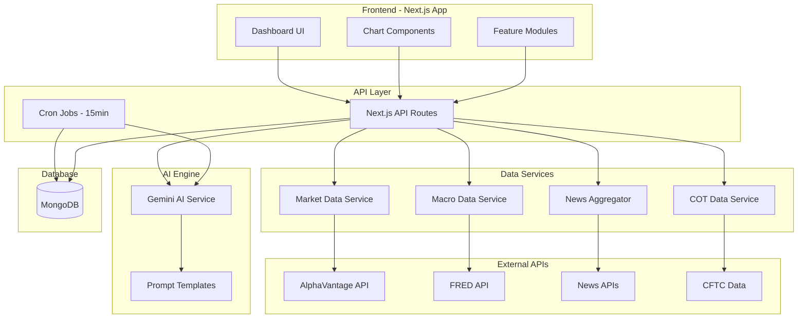

# Design Document: Gold & Forex Intelligence Dashboard

## Overview

This document outlines the technical design for a comprehensive Market Command Center dashboard for Gold (XAUUSD) and Forex analysis. The system integrates real-time market data, institutional forecasts, and AI-powered analysis using Google's Gemini model to provide institutional-grade trading intelligence.

The dashboard follows a modular architecture with a dark-themed Bloomberg Terminal aesthetic, featuring real-time updates, interactive visualizations, and collapsible modules for customization.

## Architecture



## Components and Interfaces

### 1. Dashboard Layout Component

```typescript
interface DashboardLayoutProps {
  children: React.ReactNode;
  sidebarCollapsed: boolean;
  onToggleSidebar: () => void;
}

interface ModuleConfig {
  id: string;
  title: string;
  collapsed: boolean;
  order: number;
  visible: boolean;
}
```

### 2. Gemini AI Service

```typescript
interface GeminiService {
  analyzeMarket(context: MarketContext): Promise<AIAnalysis>;
  scoreSentiment(headlines: string[]): Promise<SentimentScore>;
  simulateScenario(scenario: ScenarioInput): Promise<ScenarioResult>;
}

interface MarketContext {
  cotData: COTData;
  yields: YieldData;
  dxyMovement: number;
  news: NewsItem[];
  bankForecasts: BankForecast[];
}

interface AIAnalysis {
  bias: 'Bullish' | 'Bearish' | 'Neutral';
  summary: string;
  risk_factors: string[];
  key_levels: {
    support: number[];
    resistance: number[];
  };
  confidence: number;
  timestamp: Date;
}

interface SentimentScore {
  score: number; // -100 to +100
  breakdown: {
    positive: number;
    negative: number;
    neutral: number;
  };
}
```

### 3. Bank Forecasts Module

```typescript
interface BankForecast {
  bankName: string;
  forecastPrice: number;
  timeframe: 'Q1' | 'Q2' | 'Q3' | 'Q4' | 'Year-End';
  analystLogic: string;
  updatedAt: Date;
  analyst?: string;
}

interface BankForecastsModuleProps {
  forecasts: BankForecast[];
  consensusPrice: number;
  onRefresh: () => void;
}
```

### 4. Macro Engine Components

```typescript
interface YieldData {
  us02y: number;
  us10y: number;
  us30y: number;
  timestamp: Date;
}

interface RealYieldData {
  nominal10Y: number;
  inflationRate: number;
  realYield: number;
}

interface CorrelationData {
  asset1: string;
  asset2: string;
  coefficient: number;
  period: '1D' | '1W' | '1M' | '3M';
}

interface InflationData {
  cpi: { value: number; date: Date; impact: 'Bullish' | 'Bearish' | 'Neutral' };
  ppi: { value: number; date: Date; impact: 'Bullish' | 'Bearish' | 'Neutral' };
  pce: { value: number; date: Date; impact: 'Bullish' | 'Bearish' | 'Neutral' };
}
```

### 5. COT Analyzer

```typescript
interface COTData {
  reportDate: Date;
  nonCommercialLong: number;
  nonCommercialShort: number;
  netPosition: number;
  managedMoneyLong: number;
  managedMoneyShort: number;
  historicHigh: number;
  historicLow: number;
}

interface COTAlert {
  type: 'overcrowded' | 'extreme_short' | 'neutral';
  message: string;
  severity: 'high' | 'medium' | 'low';
}
```

### 6. Sentiment Analyzer

```typescript
interface NewsItem {
  headline: string;
  source: 'Reuters' | 'Bloomberg' | 'CentralBank';
  timestamp: Date;
  sentiment?: number;
  url?: string;
}

interface GeopoliticalRiskIndex {
  score: number; // 0-100
  keywords: {
    war: number;
    sanctions: number;
    tariffs: number;
    recession: number;
  };
  trend: 'rising' | 'falling' | 'stable';
}
```

### 7. Correlation Matrix

```typescript
interface CorrelationMatrixData {
  gold: {
    oil_wti: number;
    oil_brent: number;
    silver: number;
    copper: number;
    spx500: number;
    nasdaq: number;
    usdjpy: number;
    audusd: number;
    dxy: number;
  };
  period: string;
  updatedAt: Date;
}
```

### 8. Technical Engine

```typescript
interface TechnicalLevel {
  type: 'support' | 'resistance' | 'order_block' | 'fvg';
  price: number;
  strength: 'strong' | 'moderate' | 'weak';
  label?: string;
}

interface SMCMarker {
  type: 'order_block' | 'fair_value_gap' | 'liquidity_sweep';
  priceRange: { high: number; low: number };
  direction: 'bullish' | 'bearish';
  timestamp: Date;
}
```

### 9. Scenario Simulator

```typescript
interface ScenarioInput {
  type: 'fed_rate_cut' | 'fed_rate_hike' | 'inflation_spike' | 'geopolitical_event';
  magnitude: number; // -100 to +100 slider value
}

interface ScenarioResult {
  theoreticalPrice: number;
  priceChange: number;
  percentageChange: number;
  explanation: string;
  historicalBasis: string;
}
```

### 10. Central Bank Tracker

```typescript
interface CentralBankPurchase {
  country: 'China' | 'Russia' | 'Poland' | 'India' | 'Turkey';
  tonnage: number;
  month: string;
  year: number;
  cumulativeYTD: number;
}
```

### 11. Seasonality Data

```typescript
interface SeasonalityData {
  month: string;
  averageReturn: number;
  winRate: number;
  yearsAnalyzed: number;
}
```

## Data Models

### MongoDB Collections

```typescript
// AI Analysis Cache
interface AIAnalysisDocument {
  _id: ObjectId;
  analysis: AIAnalysis;
  context: MarketContext;
  createdAt: Date;
  expiresAt: Date;
}

// Bank Forecasts
interface BankForecastDocument {
  _id: ObjectId;
  bankName: string;
  forecastPrice: number;
  timeframe: string;
  analystLogic: string;
  createdAt: Date;
  updatedAt: Date;
  createdBy: string;
}

// Market Data Cache
interface MarketDataCacheDocument {
  _id: ObjectId;
  dataType: 'yields' | 'cot' | 'correlation' | 'inflation';
  data: any;
  source: string;
  fetchedAt: Date;
  expiresAt: Date;
}

// News Sentiment
interface NewsSentimentDocument {
  _id: ObjectId;
  headlines: NewsItem[];
  aggregateSentiment: number;
  geopoliticalIndex: GeopoliticalRiskIndex;
  analyzedAt: Date;
}

// Settings Extension
interface DashboardSettings {
  refreshInterval: number;
  enabledModules: string[];
  moduleOrder: string[];
  alertThresholds: {
    cotOvercrowded: number;
    sentimentExtreme: number;
  };
}
```

## API Routes Structure

```
/api/dashboard/
├── ai/
│   ├── analyze/          POST - Trigger AI analysis
│   ├── latest/           GET  - Get latest AI analysis
│   └── sentiment/        POST - Score news sentiment
├── market/
│   ├── yields/           GET  - Get bond yields
│   ├── dxy/              GET  - Get DXY data
│   ├── gold/             GET  - Get Gold price data
│   └── correlation/      GET  - Get correlation matrix
├── cot/
│   └── latest/           GET  - Get latest COT data
├── forecasts/
│   ├── list/             GET  - Get all bank forecasts
│   ├── create/           POST - Add new forecast (admin)
│   └── [id]/             PUT/DELETE - Update/Delete forecast
├── news/
│   └── aggregate/        GET  - Get aggregated news
├── central-banks/
│   └── purchases/        GET  - Get CB gold purchases
├── technical/
│   └── levels/           GET  - Get technical levels
└── simulator/
    └── scenario/         POST - Run scenario simulation
```


## Component Hierarchy

```mermaid
graph TD
    App[Dashboard Page]
    
    App --> Header[Header Component]
    App --> Sidebar[Sidebar Navigation]
    App --> Main[Main Content Area]
    
    Header --> AIStatus[AI Status Indicator]
    Header --> LastUpdate[Last Update Time]
    Header --> Settings[Settings Button]
    
    Main --> AICore[AI Analysis Panel]
    Main --> BankForecasts[Bank Forecasts Module]
    Main --> MacroEngine[Macro Engine Section]
    Main --> COTAnalyzer[COT Analyzer]
    Main --> SentimentPanel[Sentiment Panel]
    Main --> CorrelationMatrix[Correlation Matrix]
    Main --> TechnicalChart[Technical Chart]
    Main --> Simulator[Scenario Simulator]
    Main --> CBTracker[Central Bank Tracker]
    Main --> Seasonality[Seasonality Heatmap]
    
    AICore --> BiasIndicator[Bias Indicator]
    AICore --> RiskFactors[Risk Factors List]
    AICore --> KeyLevels[Key Levels Display]
    
    MacroEngine --> YieldCharts[Yield Charts]
    MacroEngine --> RealYieldWidget[Real Yield Widget]
    MacroEngine --> InflationFeed[Inflation Data Feed]
    MacroEngine --> DXYChart[DXY Analysis]
    
    SentimentPanel --> NewsFeed[News Feed]
    SentimentPanel --> FearGauge[Fear Gauge]
    SentimentPanel --> GeoRiskIndex[Geopolitical Risk Index]
```



## UI Design Specifications

### Color Palette (Dark Theme)

```css
:root {
  /* Background Colors */
  --bg-primary: #0a0a0f;
  --bg-secondary: #12121a;
  --bg-tertiary: #1a1a25;
  --bg-card: #16161f;
  
  /* Accent Colors */
  --gold-primary: #ffd700;
  --gold-secondary: #b8860b;
  --gold-glow: rgba(255, 215, 0, 0.3);
  
  /* Neon Accents */
  --neon-green: #00ff88;
  --neon-red: #ff4444;
  --neon-blue: #00d4ff;
  --neon-purple: #a855f7;
  
  /* Text Colors */
  --text-primary: #ffffff;
  --text-secondary: #a0a0a0;
  --text-muted: #666666;
  
  /* Status Colors */
  --bullish: #00ff88;
  --bearish: #ff4444;
  --neutral: #ffd700;
  
  /* Border Colors */
  --border-primary: #2a2a35;
  --border-glow: rgba(255, 215, 0, 0.2);
}
```

### Typography

```css
/* Font Stack */
font-family: 'Inter', 'SF Pro Display', -apple-system, BlinkMacSystemFont, sans-serif;

/* Font Sizes */
--text-xs: 0.75rem;    /* 12px - Labels, timestamps */
--text-sm: 0.875rem;   /* 14px - Secondary text */
--text-base: 1rem;     /* 16px - Body text */
--text-lg: 1.125rem;   /* 18px - Subheadings */
--text-xl: 1.25rem;    /* 20px - Module titles */
--text-2xl: 1.5rem;    /* 24px - Section headers */
--text-3xl: 2rem;      /* 32px - Main metrics */
--text-4xl: 2.5rem;    /* 40px - Hero numbers */
```

### Module Card Design

```typescript
interface ModuleCardProps {
  title: string;
  icon: React.ReactNode;
  collapsed: boolean;
  onToggle: () => void;
  children: React.ReactNode;
  glowColor?: string;
  badge?: {
    text: string;
    variant: 'bullish' | 'bearish' | 'neutral' | 'alert';
  };
}
```

## External API Integration

### 1. AlphaVantage API (Market Data)

```typescript
interface AlphaVantageConfig {
  apiKey: string;
  baseUrl: 'https://www.alphavantage.co/query';
  endpoints: {
    forex: 'CURRENCY_EXCHANGE_RATE';
    timeSeries: 'TIME_SERIES_INTRADAY';
    globalQuote: 'GLOBAL_QUOTE';
  };
}

// Rate Limits: 5 calls/minute, 500 calls/day (free tier)
```

### 2. FRED API (Economic Data)

```typescript
interface FREDConfig {
  apiKey: string;
  baseUrl: 'https://api.stlouisfed.org/fred';
  series: {
    us10y: 'DGS10';
    us02y: 'DGS2';
    us30y: 'DGS30';
    cpi: 'CPIAUCSL';
    pce: 'PCEPI';
    breakeven10y: 'T10YIE';
  };
}
```

### 3. Google Gemini API

```typescript
interface GeminiConfig {
  apiKey: string;
  model: 'gemini-1.5-flash';
  generationConfig: {
    temperature: 0.7;
    topK: 40;
    topP: 0.95;
    maxOutputTokens: 2048;
  };
}

// System Prompt Template
const SYSTEM_PROMPT = `You are a Senior Hedge Fund Strategist and Chief Investment Officer 
specializing in Gold (XAUUSD) and Forex markets. Analyze the provided market data and provide 
institutional-grade insights. Always output in the specified JSON format.`;
```

### 4. News APIs

```typescript
interface NewsSourceConfig {
  reuters: {
    rssUrl: string;
    keywords: ['gold', 'federal reserve', 'inflation', 'dollar'];
  };
  bloomberg: {
    rssUrl: string;
    keywords: ['commodities', 'precious metals', 'central bank'];
  };
}
```

## Cron Job Architecture

```typescript
// Scheduled Tasks (using Vercel Cron or similar)
interface CronSchedule {
  aiAnalysis: '*/15 * * * *';      // Every 15 minutes
  marketData: '*/5 * * * *';       // Every 5 minutes
  newsAggregation: '*/10 * * * *'; // Every 10 minutes
  cotUpdate: '0 18 * * 5';         // Friday 6 PM (COT release)
  dailyCleanup: '0 0 * * *';       // Daily at midnight
}

// Cron Job Handler
async function runScheduledAnalysis() {
  // 1. Fetch latest market data
  const marketData = await fetchAllMarketData();
  
  // 2. Aggregate news
  const news = await aggregateNews();
  
  // 3. Run AI analysis
  const analysis = await geminiService.analyzeMarket({
    ...marketData,
    news
  });
  
  // 4. Store results
  await saveAnalysis(analysis);
  
  // 5. Check for alerts
  await checkAndSendAlerts(analysis);
}
```

## Real-Time Updates Architecture

```typescript
// Using Server-Sent Events (SSE) for real-time updates
interface SSEConfig {
  endpoint: '/api/dashboard/stream';
  events: {
    'price-update': { symbol: string; price: number; change: number };
    'ai-update': AIAnalysis;
    'alert': { type: string; message: string; severity: string };
  };
}

// Client-side hook
function useDashboardStream() {
  const [data, setData] = useState<DashboardData>(initialData);
  
  useEffect(() => {
    const eventSource = new EventSource('/api/dashboard/stream');
    
    eventSource.onmessage = (event) => {
      const update = JSON.parse(event.data);
      setData(prev => mergeUpdate(prev, update));
    };
    
    return () => eventSource.close();
  }, []);
  
  return data;
}
```


## Correctness Properties

*A property is a characteristic or behavior that should hold true across all valid executions of a system—essentially, a formal statement about what the system should do. Properties serve as the bridge between human-readable specifications and machine-verifiable correctness guarantees.*

### Property 1: AI Output Structure Validation

*For any* AI analysis output from the Gemini engine, the response must be valid JSON containing all required fields: `bias` (one of 'Bullish', 'Bearish', 'Neutral'), `summary` (non-empty string), `risk_factors` (array of exactly 3 strings), and `key_levels` (object with support and resistance arrays).

**Validates: Requirements 1.4, 1.6, 1.7**

### Property 2: Market Context Completeness

*For any* market context passed to the AI analysis function, it must contain non-null values for: `cotData`, `yields`, `dxyMovement`, and `news` array with at least one item.

**Validates: Requirements 1.3**

### Property 3: Consensus Price Calculation

*For any* non-empty array of bank forecasts with valid forecast prices, the calculated consensus price must equal the arithmetic mean of all forecast prices (sum of prices divided by count).

**Validates: Requirements 2.3**

### Property 4: Bank Forecast Display Completeness

*For any* bank forecast object rendered in the UI, the output must contain the bank name, forecast price, timeframe, and analyst logic fields.

**Validates: Requirements 2.2**

### Property 5: Correlation Coefficient Validity

*For any* calculated correlation coefficient between two price series, the value must be within the range [-1, 1] inclusive.

**Validates: Requirements 3.2**

### Property 6: Real Yield Calculation

*For any* nominal 10Y yield value and inflation rate/breakeven value, the calculated real yield must equal exactly: `nominal10Y - inflationRate`.

**Validates: Requirements 3.4**

### Property 7: Inflation Impact Tagging

*For any* inflation data point (CPI, PPI, or PCE), it must have an associated `impact` field with value 'Bullish', 'Bearish', or 'Neutral'.

**Validates: Requirements 3.5**

### Property 8: COT Histogram Data Accuracy

*For any* COT data object, the histogram representation must correctly show `managedMoneyLong` and `managedMoneyShort` values, and the net position must equal `managedMoneyLong - managedMoneyShort`.

**Validates: Requirements 4.2**

### Property 9: COT Overcrowded Alert Generation

*For any* COT data where `managedMoneyLong` exceeds the `historicHigh` threshold, the system must generate an alert with type 'overcrowded'.

**Validates: Requirements 4.3**

### Property 10: News Source Aggregation

*For any* aggregated news feed returned by the sentiment analyzer, it must contain at least one item from each source: 'Reuters', 'Bloomberg', and 'CentralBank' (when available).

**Validates: Requirements 5.1**

### Property 11: Sentiment Score Range

*For any* sentiment score calculated by the AI, the value must be within the range [-100, 100] inclusive.

**Validates: Requirements 5.2**

### Property 12: Geopolitical Risk Index Completeness

*For any* geopolitical risk index calculation, it must track and include scores for all four keyword categories: 'war', 'sanctions', 'tariffs', and 'recession', and the aggregate score must be within [0, 100].

**Validates: Requirements 5.3, 5.4**

### Property 13: Correlation Change Highlighting

*For any* correlation value change that exceeds the configured threshold (default 0.1), the UI must apply a highlight class to indicate significant change.

**Validates: Requirements 6.5**

### Property 14: Technical Level Validity

*For any* identified supply/demand zone or technical level, the price value must be within the range of the analyzed price series (between min and max prices).

**Validates: Requirements 7.1**

### Property 15: SMC Marker Validity

*For any* Smart Money Concepts marker (Order Block or Fair Value Gap), it must have a valid `type`, a `priceRange` with `high >= low`, and a `direction` of either 'bullish' or 'bearish'.

**Validates: Requirements 7.2**

### Property 16: Scenario Simulation Output

*For any* scenario simulation with a valid slider input (-100 to 100), the result must contain a `theoreticalPrice` (positive number), `priceChange`, `percentageChange`, and non-empty `explanation` string.

**Validates: Requirements 8.2, 8.3**

### Property 17: Central Bank Data Coverage

*For any* central bank gold purchases data set, it must include entries for at least the three primary tracked countries: 'China', 'Russia', and 'Poland'.

**Validates: Requirements 9.2**

### Property 18: Seasonality Data Completeness

*For any* seasonality data set, it must contain exactly 12 entries (one for each month), each with `month`, `averageReturn`, and `winRate` fields.

**Validates: Requirements 10.1, 10.2, 10.3**

### Property 19: Module Collapse Toggle

*For any* collapsible module, toggling the collapse state must invert the `collapsed` boolean and change the module's content visibility accordingly.

**Validates: Requirements 11.3**

### Property 20: Loading State Display

*For any* module in a loading state (data being fetched), a loading indicator must be rendered and visible to the user.

**Validates: Requirements 11.6**

## Error Handling

### API Error Handling

```typescript
interface APIError {
  code: string;
  message: string;
  retryable: boolean;
  retryAfter?: number;
}

const errorHandlers = {
  // Gemini API Errors
  'GEMINI_RATE_LIMIT': {
    action: 'retry',
    delay: 60000,
    fallback: 'Use cached analysis'
  },
  'GEMINI_INVALID_KEY': {
    action: 'alert_admin',
    fallback: 'Display error message'
  },
  
  // Market Data Errors
  'MARKET_DATA_UNAVAILABLE': {
    action: 'retry',
    delay: 5000,
    maxRetries: 3,
    fallback: 'Use last known values'
  },
  
  // Database Errors
  'DB_CONNECTION_FAILED': {
    action: 'retry',
    delay: 1000,
    maxRetries: 5,
    fallback: 'Use in-memory cache'
  }
};
```

### Graceful Degradation

1. **AI Unavailable**: Display last cached analysis with timestamp
2. **Market Data Stale**: Show data with "Last updated X minutes ago" warning
3. **News Feed Down**: Display cached headlines with staleness indicator
4. **Partial Data**: Render available modules, show "Data unavailable" for others

### User Notifications

```typescript
interface Notification {
  type: 'info' | 'warning' | 'error' | 'success';
  title: string;
  message: string;
  duration?: number;
  action?: {
    label: string;
    onClick: () => void;
  };
}
```

## Testing Strategy

### Unit Tests

Unit tests will verify specific examples and edge cases:

1. **Calculation Functions**
   - Consensus price calculation with various inputs
   - Real yield calculation
   - Correlation coefficient calculation
   - Seasonality average calculations

2. **Data Validation**
   - AI output JSON schema validation
   - COT data structure validation
   - Bank forecast field validation

3. **UI Components**
   - Module collapse/expand behavior
   - Loading state rendering
   - Error state rendering

### Property-Based Tests

Property-based tests will use **fast-check** library for JavaScript/TypeScript to verify universal properties across many generated inputs.

**Configuration:**
- Minimum 100 iterations per property test
- Each test tagged with: `Feature: gold-forex-intelligence-dashboard, Property {N}: {description}`

**Test Categories:**

1. **Data Integrity Properties**
   - Property 3: Consensus calculation
   - Property 5: Correlation bounds
   - Property 6: Real yield formula
   - Property 8: COT net position calculation

2. **Output Validation Properties**
   - Property 1: AI output structure
   - Property 11: Sentiment score range
   - Property 12: Risk index bounds

3. **Business Logic Properties**
   - Property 9: Alert generation
   - Property 13: Highlight triggering
   - Property 16: Simulation output

4. **Data Completeness Properties**
   - Property 2: Market context
   - Property 10: News sources
   - Property 17: Central bank coverage
   - Property 18: Seasonality months

### Integration Tests

1. **API Route Tests**
   - Test each API endpoint with mock data
   - Verify response structure and status codes

2. **Data Flow Tests**
   - Test data aggregation pipeline
   - Test cron job execution flow

3. **Real-time Update Tests**
   - Test SSE connection and message handling
   - Test state synchronization

### E2E Tests (Playwright)

1. **Dashboard Load**
   - Verify all modules render
   - Verify initial data loads

2. **User Interactions**
   - Module collapse/expand
   - Scenario simulator slider
   - Settings changes

3. **Real-time Updates**
   - Verify price updates reflect in UI
   - Verify AI analysis updates
